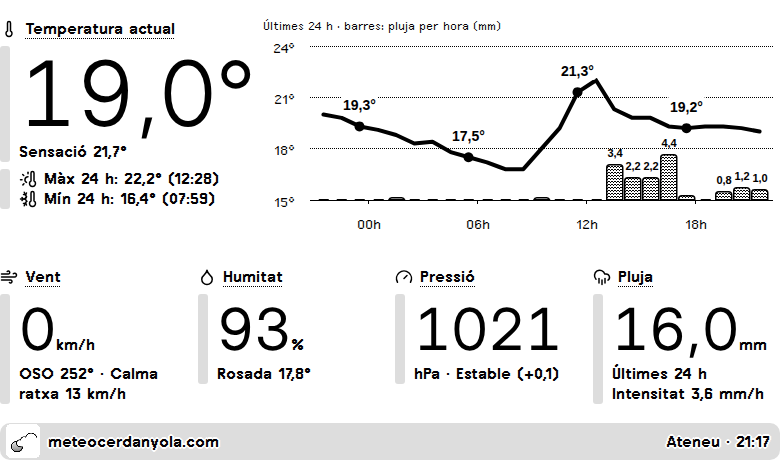
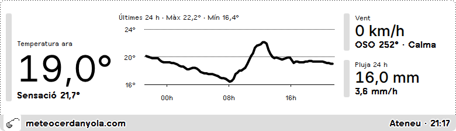
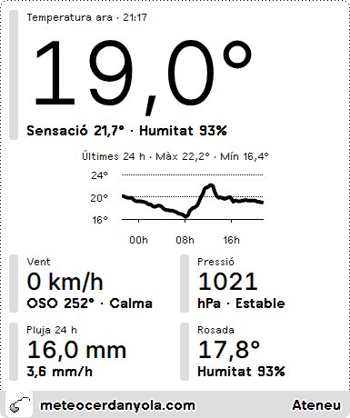
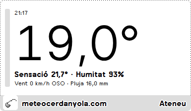

# meteocerdanyola.com · plugin per a TRMNL

[Castellano](README.md) · **Català**

Plugin privat per a [TRMNL](https://usetrmnl.com) (pantalla e-ink) que mostra el temps en directe de les estacions de [meteocerdanyola.com](https://meteocerdanyola.com), a Cerdanyola del Vallès (Barcelona).

Projecte personal i no oficial: les dades són de meteocerdanyola.com.

## Captures



| Mitja pantalla horitzontal | Mitja pantalla vertical | Quart de pantalla |
|---|---|---|
|  |  |  |

Captures amb dades reals de l'estació Ateneu, renderitzades en un navegador: la pantalla real és d'1 bit (blanc i negre).

## Què mostra

- **Temperatura actual**, sensació tèrmica i **gràfic de les últimes 24 h** amb la temperatura hora a hora (marcada a les 00, 06, 12 i 18 h) i **barres amb la pluja de cada hora**, i, sota la temperatura, la màxima i la mínima amb l'hora a la qual es van donar.
- **Vent** (actual, direcció i graus, i ratxa màxima de les 24 h).
- **Pressió** i la seva tendència en les últimes 3 hores.
- **Pluja** acumulada en les últimes 24 h i intensitat actual (mm/h).
- **Humitat** i punt de rosada.
- Hora de l'última lectura. Si l'estació fa més de 45 minuts que no envia dades, es marca com a endarrerida.

Inclou les quatre vistes de TRMNL: pantalla completa, mitja pantalla horitzontal, mitja pantalla vertical i quart de pantalla.

## Ajustos del plugin

| Camp | Valors | Per defecte |
|---|---|---|
| **Estació meteorològica** (`station`) | `cerdanyola_ateneu`, `cerdanyola_centre`, `cerdanyola_montflorit` | `cerdanyola_ateneu` |
| **Idioma** (`language`) | Català (`ca`), Castellano (`es`), English (`en`) | `es` |

L'idioma canvia tots els textos, el separador decimal (coma en català i castellà, punt en anglès) i les lletres de la rosa dels vents (O/W).

## Com funciona

1. TRMNL consulta cada 15 minuts l'API de dades obertes de l'estació triada:
   `https://meteocerdanyola.com/2026/api/open-data.php?v=1&slug=<estació>&dataset=recent&hours=24&variables=temperature,humidity,wind,pressure,rain&format=json`
2. [`src/transform.js`](src/transform.js) redueix la resposta (unes 1.100-1.400 lectures, 400-550 KB) a uns 9 KB: valors actuals, màximes i mínimes, tendència de pressió, punt de rosada i sèries agrupades cada 15 minuts (i per hores per al gràfic de la vista completa). La pluja per hora es calcula a partir de l'acumulat diari, que es reinicia a mitjanit.
3. Les plantilles Liquid donen format als números, tradueixen els textos i dibuixen el gràfic amb Highcharts.

Les dades que l'estació no envia es mostren com a `—`; mai s'interpreten com a zero.

## Estructura del repositori

```
src/
├── settings.yml            # URL de consulta i camps del plugin (estació, idioma)
├── transform.js            # redueix i calcula les dades
├── shared.liquid           # traduccions, icones i funció del gràfic
├── full.liquid             # pantalla completa
├── half_horizontal.liquid  # mitja pantalla horitzontal
├── half_vertical.liquid    # mitja pantalla vertical
└── quadrant.liquid         # quart de pantalla
assets/
└── icon-512.png            # icona del plugin (512×512, fons blanc)
docs/screenshots/           # captures del README
```

## Instal·lació

Crea un plugin privat a TRMNL (*Plugins → Private Plugin*) i copia el contingut de `src/`:

1. **Estratègia**: Polling (GET). A *Polling URL* enganxa la `polling_url` de `src/settings.yml`.
2. **Form fields**: enganxa el bloc `custom_fields` de `src/settings.yml`.
3. **Transform**: enganxa `src/transform.js`.
4. **Markup**: enganxa cada `.liquid` a la seva pestanya (*Shared*, *Full*, *Half horizontal*, *Half vertical*, *Quadrant*).
5. **Framework CSS version**: el disseny està comprovat al dispositiu amb la `3.4.0` (l'actual) i amb la `2.3.7`. Serveix qualsevol de les dues.
6. Desa i tria estació i idioma als ajustos del plugin.

## Dades i condicions d'ús

Les dades provenen de l'API de dades obertes de [meteocerdanyola.com](https://meteocerdanyola.com) (JDServer). Segons el propi contracte de l'API, la descàrrega no concedeix per si sola una llicència oberta addicional i la reutilització pot requerir autorització: consulta l'avís legal de cada estació abans de redistribuir les dades. La informació és orientativa i no substitueix els avisos oficials.
