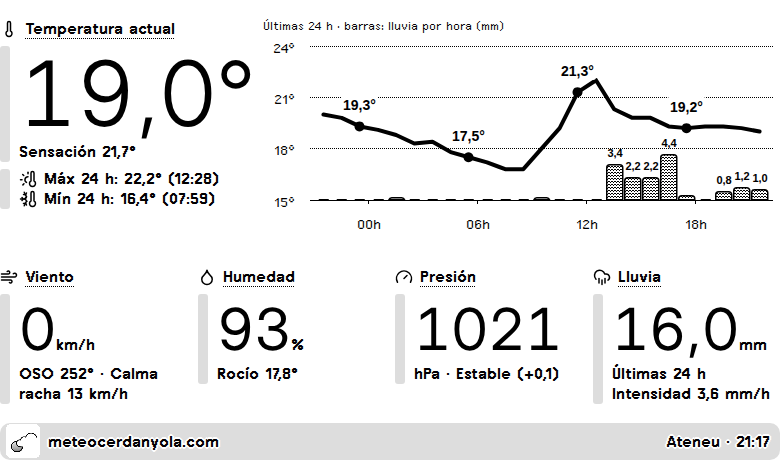
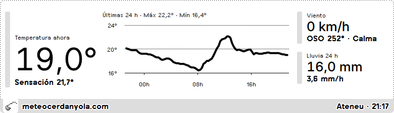
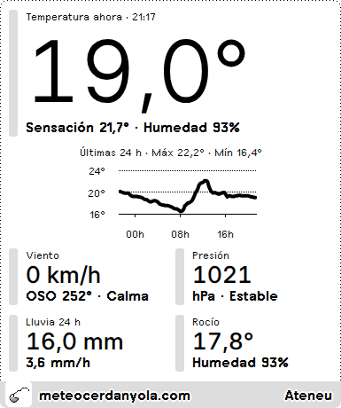
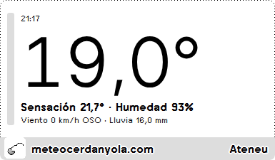

# meteocerdanyola.com · plugin para TRMNL

**Castellano** · [Català](README.md)

Plugin privado para [TRMNL](https://usetrmnl.com) (pantalla e-ink) que muestra el tiempo en directo de las estaciones de [meteocerdanyola.com](https://meteocerdanyola.com), en Cerdanyola del Vallès (Barcelona).

Proyecto personal y no oficial: los datos son de meteocerdanyola.com.

## Capturas



| Media pantalla horizontal | Media pantalla vertical | Cuarto de pantalla |
|---|---|---|
|  |  |  |

Capturas con datos reales de la estación Ateneu, renderizadas en un navegador: la pantalla real es de 1 bit (blanco y negro).

## Qué muestra

- **Temperatura actual**, sensación térmica y **gráfico de las últimas 24 h** con la temperatura hora a hora (marcada a las 00, 06, 12 y 18 h) y **barras con la lluvia de cada hora**, y, bajo la temperatura, la máxima y la mínima con la hora a la que se dieron.
- **Viento** (actual, dirección y grados, y racha máxima de las 24 h).
- **Presión** y su tendencia en las últimas 3 horas.
- **Lluvia** acumulada en las últimas 24 h e intensidad actual (mm/h).
- **Humedad** y punto de rocío.
- Hora de la última lectura. Si la estación lleva más de 45 minutos sin enviar datos, se marca como retrasada.

Incluye las cuatro vistas de TRMNL: pantalla completa, media pantalla horizontal, media pantalla vertical y cuarto de pantalla.

Se adapta al tamaño de la pantalla (probado en la normal, de 800×480 y 1 bit, y en la TRMNX, de 1040×780 y escala de grises): el gráfico ocupa el espacio vertical que sobra.

## Ajustes del plugin

| Campo | Valores | Por defecto |
|---|---|---|
| **Estación meteorológica** (`station`) | `cerdanyola_ateneu`, `cerdanyola_centre`, `cerdanyola_montflorit` | `cerdanyola_ateneu` |
| **Idioma** (`language`) | Català (`ca`), Castellano (`es`), English (`en`) | `es` |

El idioma cambia todos los textos, el separador decimal (coma en catalán y castellano, punto en inglés) y las letras de la rosa de los vientos (O/W).

## Cómo funciona

1. TRMNL consulta cada 15 minutos la API de datos abiertos de la estación elegida:
   `https://meteocerdanyola.com/2026/api/open-data.php?v=1&slug=<estación>&dataset=recent&hours=24&variables=temperature,humidity,wind,pressure,rain&format=json`
2. [`src/transform.js`](src/transform.js) reduce la respuesta (unas 1.100-1.400 lecturas, 400-550 KB) a unos 9 KB: valores actuales, máximas y mínimas, tendencia de presión, punto de rocío y series agrupadas cada 15 minutos (y por horas para el gráfico de la vista completa). La lluvia por hora se calcula a partir del acumulado diario, que se reinicia a medianoche.
3. Las plantillas Liquid dan formato a los números, traducen los textos y dibujan el gráfico con Highcharts.

Los datos que la estación no envía se muestran como `—`; nunca se interpretan como cero.

## Estructura del repositorio

```
src/
├── settings.yml            # URL de consulta y campos del plugin (estación, idioma)
├── transform.js            # reduce y calcula los datos
├── shared.liquid           # traducciones, iconos y función del gráfico
├── full.liquid             # pantalla completa
├── half_horizontal.liquid  # media pantalla horizontal
├── half_vertical.liquid    # media pantalla vertical
└── quadrant.liquid         # cuarto de pantalla
assets/
└── icon-512.png            # icono del plugin (512×512, fondo blanco)
docs/screenshots/           # capturas del README
```

## Instalación

Crea un plugin privado en TRMNL (*Plugins → Private Plugin*) y copia el contenido de `src/`:

1. **Estrategia**: Polling (GET). En *Polling URL* pega la `polling_url` de `src/settings.yml`.
2. **Form fields**: pega el bloque `custom_fields` de `src/settings.yml`.
3. **Transform**: pega `src/transform.js`.
4. **Markup**: pega cada `.liquid` en su pestaña (*Shared*, *Full*, *Half horizontal*, *Half vertical*, *Quadrant*).
5. **Framework CSS version**: el diseño está comprobado en el dispositivo con la `3.4.0` (la actual) y con la `2.3.7`. Sirve cualquiera de las dos.
6. Guarda y elige estación e idioma en los ajustes del plugin.

## Datos y condiciones de uso

Los datos proceden de la API de datos abiertos de [meteocerdanyola.com](https://meteocerdanyola.com) (JDServer). Según el propio contrato de la API, la descarga no concede por sí sola una licencia abierta adicional y la reutilización puede requerir autorización: consulta el aviso legal de cada estación antes de redistribuir los datos. La información es orientativa y no sustituye los avisos oficiales.
